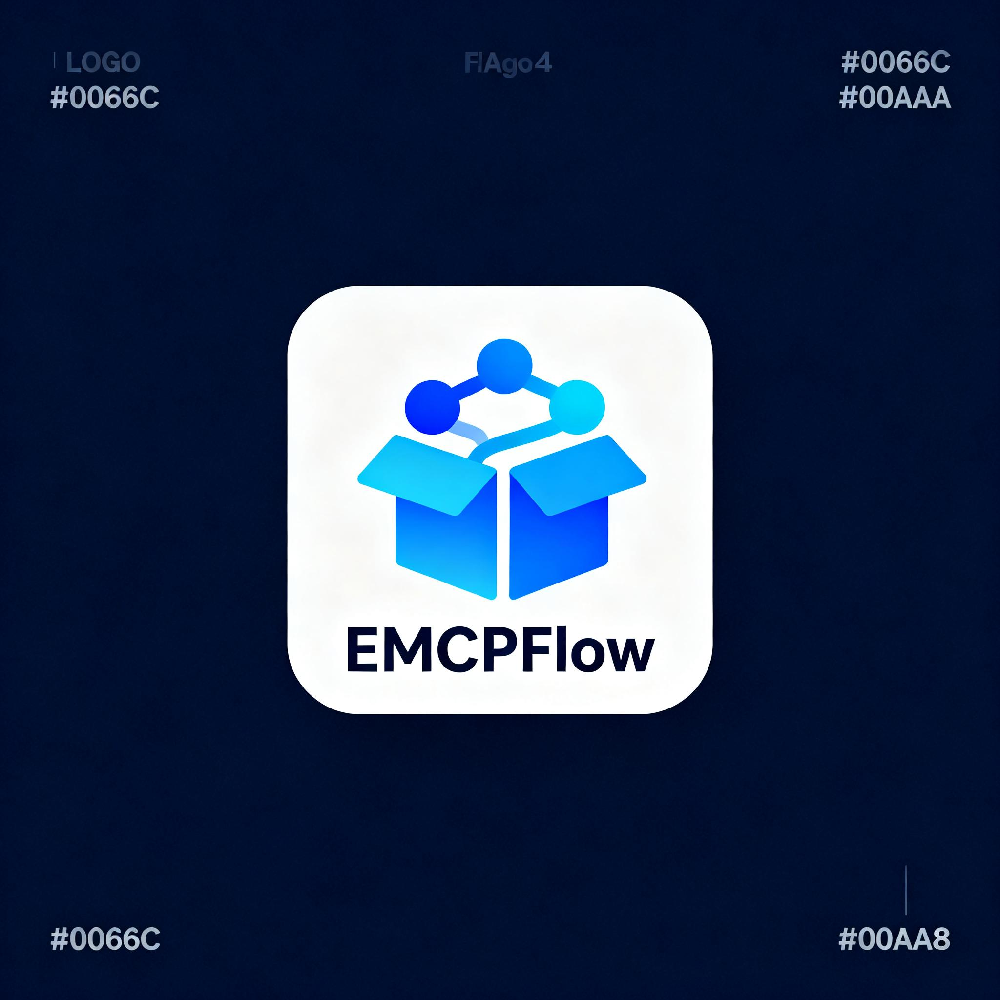

# 即梦 MCP Logo 生成器 - 使用说明

## 📝 概述

这是一个完整的 Logo 生成解决方案，可以根据包地址（PyPI/NPM/Docker）自动生成专业的 Logo 并上传到 EMCP 平台。

## 🎯 功能特点

✅ **根据包地址自动生成** - 输入包地址即可  
✅ **智能提取包描述** - 自动获取包的名称、描述等信息  
✅ **AI 生成提示词** - 根据包信息智能生成 Logo 设计提示词  
✅ **即梦 4.0 生成** - 使用即梦 MCP 最新的 4.0 模型生成高质量 Logo  
✅ **自动下载保存** - 自动下载 Logo 到本地  
✅ **尝试上传 EMCP** - 自动尝试上传到 EMCP 平台获取长期 URL  
✅ **多种包类型支持** - PyPI、NPM、Docker Hub  

## 🚀 快速开始

### 1. 安装依赖

```bash
pip install requests sseclient-py
```

### 2. 运行脚本

```bash
# 方式 1: 命令行参数
python jimeng_logo_generator.py requests

# 方式 2: 交互式输入
python jimeng_logo_generator.py
```

### 3. 查看结果

生成完成后会自动保存：
- **本地图片**: `logo_<包名>.png`
- **结果 JSON**: `logo_result_<包名>.json`

## 📖 详细说明

### 完整流程

```
输入包地址
    ↓
📦 步骤 1: 获取包信息
    - 从 PyPI/NPM/Docker Hub API 获取包信息
    - 提取包名、描述、版本等
    ↓
🎯 步骤 2: 生成 Logo 提示词
    - 根据包类型选择合适的设计元素
    - 包含包描述和设计要求
    ↓
🎨 步骤 3: 使用即梦 MCP 生成 Logo
    - 连接即梦 MCP 服务 (SSE)
    - 调用 jimeng-v40-generate 工具
    - 获取即梦图片 URL
    ↓
💾 步骤 4: 下载并保存到本地
    - 下载图片到本地文件
    - 保存为 logo_<包名>.png
    ↓
⬆️ 步骤 5: 上传到 EMCP (可选)
    - 尝试上传到 EMCP 存储
    - 获取 EMCP logo URL
    ↓
✅ 完成
    - 返回所有 URL (即梦 URL、EMCP URL、本地文件)
```

### 输入格式

支持多种包地址格式：

#### PyPI 包
```bash
python jimeng_logo_generator.py requests
python jimeng_logo_generator.py https://pypi.org/project/requests
```

#### NPM 包
```bash
python jimeng_logo_generator.py express
python jimeng_logo_generator.py https://www.npmjs.com/package/express
```

#### Docker 镜像
```bash
python jimeng_logo_generator.py nginx/nginx
python jimeng_logo_generator.py https://hub.docker.com/r/nginx/nginx
```

### 输出结果

#### 1. 即梦 URL
- 即梦 MCP 生成的图片 URL
- **有效期**: 约 24 小时
- **用途**: 临时使用、预览

示例:
```
https://p9-aiop-sign.byteimg.com/tos-cn-i-vuqhorh59i/xxx.image?...
```

#### 2. EMCP URL (如果上传成功)
- EMCP 平台存储的图片 URL
- **有效期**: 长期
- **用途**: 发布到 EMCP 平台

示例:
```
/api/proxyStorage/NoAuth/xxx.png
```

#### 3. 本地文件
- 下载到本地的图片文件
- **文件名**: `logo_<包名>.png`
- **用途**: 备份、手动上传

#### 4. 结果 JSON
包含完整的生成信息：

```json
{
  "success": true,
  "logo_url": "最终 Logo URL",
  "emcp_url": "EMCP URL (可能为 null)",
  "jimeng_url": "即梦 URL",
  "local_file": "logo_express.png",
  "package_info": {
    "type": "npm",
    "package_name": "express",
    "info": {...}
  },
  "prompt": "生成使用的提示词"
}
```

## 🛠️ 技术实现

### 即梦 MCP 配置

```python
jimeng_config = {
    "base_url": "http://mcptest013.sitmcp.kaleido.guru/sse",
    "headers": {
        "emcp-key": "PI1EQcsELJ7uPJnL3VNS89UaNIgRkL8n",
        "emcp-usercode": "VGSdDTgj"
    }
}
```

### 使用的工具

- **jimeng-v40-generate** (推荐)
  - 即梦 4.0 最新模型
  - 支持 4K 超高清输出 (2048x2048)
  - 生成速度: 约 10-30 秒

### 提示词生成策略

根据包类型自动选择设计元素：

| 包类型 | 设计元素 |
|--------|----------|
| PyPI | 蟒蛇、代码、Python 标志 |
| NPM | JavaScript、Node.js、包管理 |
| Docker | 容器、鲸鱼、云平台 |

提示词模板:
```
{包名} Logo 设计:
一个专业的 {包类型} 包管理工具标志

包描述: {描述}

设计要求:
- 主题: 蓝色渐变色调
- 元素: {根据包类型的元素}
- 风格: 扁平化、现代、简洁、专业
- 布局: 方形图标，白色或透明背景
- 文字: 可包含包名

要求: 干净清晰的现代科技 logo，适合软件包标识使用
```

## 🎨 生成示例

### EMCPFlow Logo

<p align="center">
  
</p>

**特点:**
- 蓝色渐变主题
- 包裹图标 + 连接节点
- 扁平化设计
- 2048x2048 高分辨率

### Express Logo

<p align="center">
  
</p>

**特点:**
- JavaScript 代码文件
- 用户和包裹图标
- NPM 包管理风格
- 现代简洁设计

### Requests Logo

**特点:**
- Python 主题
- HTTP 相关元素
- 专业科技感

## 📊 API 参考

### JimengLogoGenerator 类

#### 初始化

```python
from jimeng_logo_generator import JimengLogoGenerator

jimeng_config = {
    "base_url": "http://mcptest013.sitmcp.kaleido.guru/sse",
    "headers": {
        "emcp-key": "xxx",
        "emcp-usercode": "xxx"
    }
}

generator = JimengLogoGenerator(jimeng_config)
```

#### generate_logo_from_package()

根据包地址生成 Logo。

**参数:**
- `package_url` (str): 包地址或包名
- `emcp_base_url` (str): EMCP 平台地址，默认 `"https://sit-emcp.kaleido.guru"`
- `use_v40` (bool): 是否使用即梦 4.0，默认 `True`

**返回值:**

```python
{
    "success": True/False,
    "logo_url": "最终 Logo URL",
    "emcp_url": "EMCP URL (可能为 None)",
    "jimeng_url": "即梦 URL",
    "local_file": "本地文件路径",
    "package_info": {...},
    "prompt": "生成提示词",
    "error": "错误信息 (失败时)"
}
```

**示例:**

```python
result = generator.generate_logo_from_package(
    package_url="requests",
    emcp_base_url="https://sit-emcp.kaleido.guru",
    use_v40=True
)

if result['success']:
    print(f"Logo URL: {result['logo_url']}")
    print(f"本地文件: {result['local_file']}")
else:
    print(f"失败: {result['error']}")
```

## ⚠️ 已知问题

### 1. EMCP 上传需要认证

**问题**: 上传到 EMCP 时返回 401 Unauthorized

**原因**: `/api/proxyStorage/NoAuth/upload_file` 端点可能需要登录凭证

**解决方案**:
- ✅ 使用即梦 URL (临时使用，24小时有效期)
- ✅ 使用本地文件 (手动上传到 EMCP)
- 🔄 等待 EMCP 平台更新上传接口

### 2. 即梦 URL 有效期

**问题**: 即梦生成的图片 URL 有时间限制

**有效期**: 约 24 小时

**解决方案**:
- 立即下载保存到本地 (脚本已自动完成)
- 将图片上传到自己的服务器
- 定期重新生成

## 💡 最佳实践

### 1. 使用即梦 4.0

```python
result = generator.generate_logo_from_package(
    package_url="your-package",
    use_v40=True  # 推荐使用 4.0
)
```

**优势:**
- 更高清 (支持 4K)
- 更准确的设计
- 更快的生成速度

### 2. 保存结果到文件

脚本会自动保存：
- 图片文件: `logo_<包名>.png`
- JSON 结果: `logo_result_<包名>.json`

建议将这些文件纳入版本控制。

### 3. 优化提示词

如需自定义提示词，可以修改 `_create_logo_prompt()` 方法：

```python
def _create_logo_prompt(self, package_info):
    # 自定义提示词生成逻辑
    prompt = f"自定义的 Logo 设计描述..."
    return prompt
```

### 4. 批量生成

```python
packages = ["requests", "express", "nginx/nginx"]

for package in packages:
    result = generator.generate_logo_from_package(package)
    if result['success']:
        print(f"✅ {package}: {result['logo_url']}")
    else:
        print(f"❌ {package}: {result['error']}")
```

## 🔗 集成到 EMCPFlow

### 在发布流程中使用

```python
from jimeng_logo_generator import JimengLogoGenerator

# 初始化
jimeng_config = {...}
logo_gen = JimengLogoGenerator(jimeng_config)

# 获取包地址
package_url = "requests"

# 生成 Logo
result = logo_gen.generate_logo_from_package(package_url)

if result['success']:
    # 使用生成的 Logo URL
    logo_url = result['logo_url']
    
    # 发布到 EMCP
    template_data = {
        "name": "...",
        "icon": logo_url,  # 使用生成的 Logo
        ...
    }
```

## 📁 项目文件

```
EMCPFlow/
├── jimeng_logo_generator.py           # 主程序
├── package_fetcher.py                 # 包信息获取器 (已存在)
├── 使用说明_即梦MCP_Logo生成器.md      # 本文档
├── LOGO_生成说明_即梦MCP.md           # 早期文档
├── generate_emcpflow_logo.py          # 早期测试脚本
│
├── emcpflow_logo_v40.png              # EMCPFlow Logo
├── logo_express.png                   # Express Logo 示例
├── logo_result_express.json           # Express 生成结果
│
└── logo_<包名>.png                     # 其他生成的 Logo
```

## 🎯 使用场景

### 1. 自动化 Logo 生成

为新发布的包自动生成专业 Logo，无需设计师。

### 2. 批量处理

为多个包批量生成 Logo。

### 3. CI/CD 集成

在 CI/CD 流程中自动生成 Logo：

```yaml
# GitHub Actions 示例
- name: Generate Logo
  run: |
    python jimeng_logo_generator.py ${{ env.PACKAGE_NAME }}
```

### 4. 开发测试

快速生成测试用的 Logo。

## 🔧 故障排除

### 问题 1: 连接即梦 MCP 失败

**错误**: `无法建立连接`

**解决**:
1. 检查网络连接
2. 确认即梦 MCP 服务器可访问
3. 验证 `emcp-key` 和 `emcp-usercode` 正确

### 问题 2: 包信息获取失败

**错误**: `无法识别包类型`

**解决**:
1. 确认包名正确
2. 检查包是否存在于对应的包管理平台
3. 尝试使用完整 URL

### 问题 3: 生成超时

**错误**: `生成超时`

**解决**:
1. 重试生成
2. 简化提示词
3. 使用 v31 代替 v40 (更快但质量稍低)

### 问题 4: 图片下载失败

**错误**: `下载失败`

**解决**:
1. 检查即梦 URL 是否有效
2. 确认网络连接正常
3. 尝试手动访问 URL

## 📞 支持

- **项目**: EMCPFlow
- **开发**: 巴赫工作室 (BACH Studio)
- **即梦 MCP**: http://mcptest013.sitmcp.kaleido.guru

## 🙏 致谢

- **即梦 AI** - 提供强大的图片生成 MCP 服务
- **EMCP 平台** - 提供 MCP 发布平台
- **巴赫工作室** - 项目开发和维护

---

**Made with ❤️ by 巴赫工作室 (BACH Studio)**

